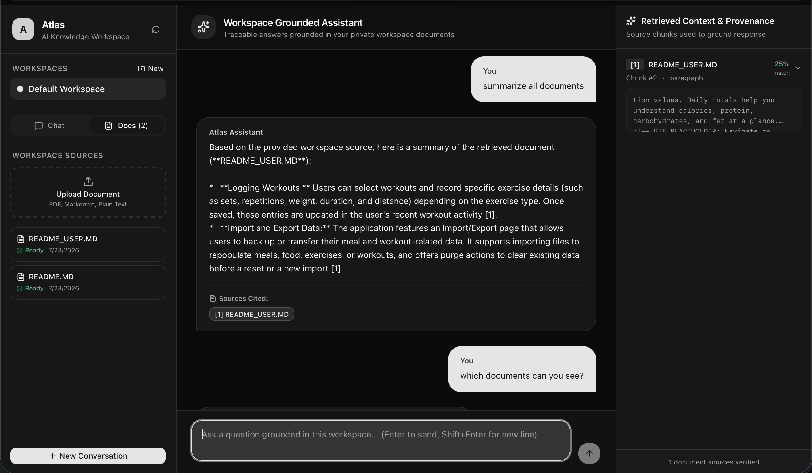

# Atlas

Atlas is a self-hosted AI knowledge workspace. This repository contains the
Next.js interface (`/`) and Spring Boot API (`/backend`).

## Run locally

1. Copy `.env.example` to `.env` and replace the development password.
2. Run `docker-compose up --build`.
3. Open `http://localhost:3000`; the API health endpoint is at
   `http://localhost:8080/actuator/health`.

## API foundation

The API currently exposes workspace CRUD at `/api/workspaces`. Flyway owns the
database schema; do not use Hibernate DDL updates. Future document, retrieval,
and chat services must require a workspace ID and preserve citation metadata.
