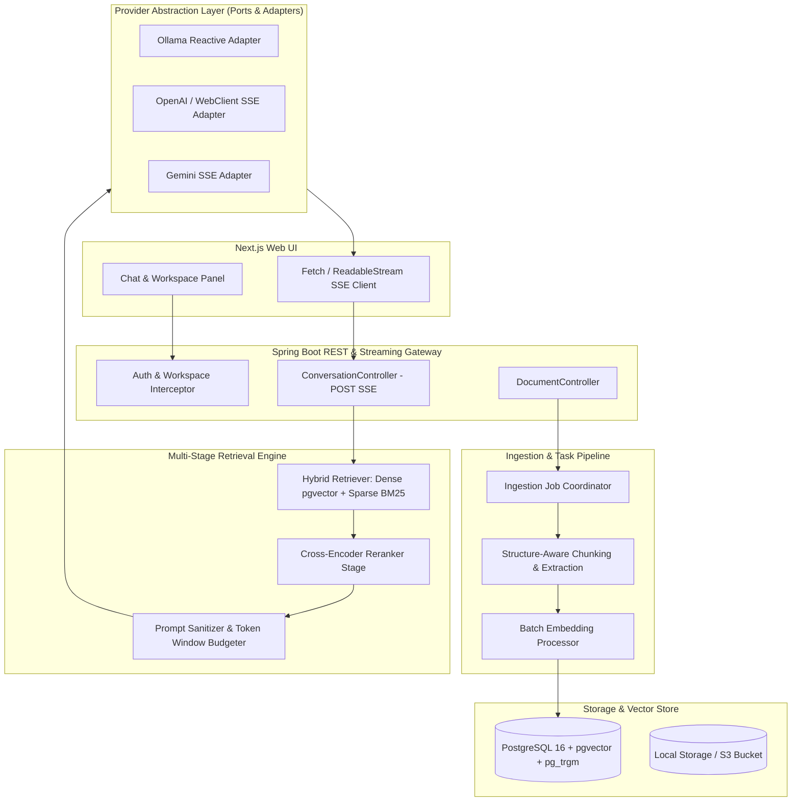

# Atlas Master Implementation & Architecture Plan

Atlas is a self-hosted AI knowledge workspace. It lets users organize private source material into isolated workspaces, ask grounded questions, and receive streamed answers with traceable citations.

This master plan combines the core product roadmap with architectural counterplan improvements, prioritizing immediate technical debt remediation, production-grade RAG pipelines, and enterprise security.

> **Assessment date:** 2026-07-30 against `main` (`22fb7cf`). Phase 0 exit criteria are met. Phase 1 is largely open; HNSW already exists in schema. Frontend vertical slice works, with known UX bugs and **zero** FE tests.

---

## Priority & Phase Definitions

- **Phase 0 (P0 Remediation) — Must Fix Immediately:** Critical security, database, streaming, and data pipeline fixes to transform existing prototype stubs into a reliable, non-blocking vertical slice.
- **Phase 1 (P0/P1 Infrastructure) — Production RAG & Ingestion:** Batch embedding, structure-aware chunking, hybrid retrieval (Dense + BM25 + RRF), and true async job queues.
- **Phase 2 (P1/P2 Expansion) — Enterprise Security & Advanced Engine:** Authentication, RBAC, prompt injection boundaries, sliding-window token budgeting, and citation precision filtering.
- **Phase 3 (P2/P3 Advanced) — Scalability & Knowledge Graph:** GraphRAG, knowledge visualization, agent workflows, plugin architecture, and horizontal scaling.

---

## Current State Snapshot (main)

| Area | Status | Notes |
| :--- | :--- | :--- |
| Monorepo + Docker Compose | Done | `postgres` (pgvector), `api`, `web` |
| Flyway schema | Done | `V1`–`V3`; HNSW present; `vector(768)` after V3 |
| Workspace / doc / chat CRUD | Done | BE + FE panels |
| Cascade FK on citations | Done | `ON DELETE CASCADE` in V1 |
| POST SSE streaming | Done | `WebClient` Flux → `SseEmitter`; no `Thread.sleep` |
| Jackson DTO parsing | Done | Embedding + LLM DTOs; no JSON substring hacks |
| Persistent ingestion jobs + recovery | Done | `ingestion_jobs` + `ApplicationReadyEvent` recovery |
| HNSW index | Done (ahead of plan) | Present in V1/V3 |
| Batch embeddings | Not started | `embedAll` is serial loop |
| Structure/token-aware chunking | Not started | Fixed 1100-char windows |
| Hybrid BM25 + RRF | Not started | Dense cosine only |
| Relative score filter | Human shipped | Keep ≥ `topScore * 0.9` after top-15 retrieve |
| Rerank / citation precision | Not started | All retrieved chunks saved as citations |
| Auth / RBAC | Not started | No Spring Security; no FE auth |
| Backend tests | Thin | 7 unit-style tests; Testcontainers underused |
| Frontend tests | Absent | No vitest/jest/playwright; no `test` script |

### Known product debt (fix before or alongside next RAG work)

| Item | Layer | Severity |
| :--- | :--- | :--- |
| Rename conversation modal never binds target id | FE `sidebar.tsx` | Bug |
| Empty-state / submit when docs tab + no conversation | FE `chat-panel.tsx` | Bug |
| SSE `chunk` events ignored; full reload on `done` | FE | Incomplete |
| Sources panel shows debug similarity (raw/calc/round) | FE `sources-panel.tsx` | Polish |
| Embedding dim constant (1536) vs DB `vector(768)` mismatch risk | BE | Correctness |
| Providers are monolithic if/else, not ports/adapters | BE | Debt |
| No `@WebMvcTest` / real pgvector Testcontainers coverage | BE tests | Gap |

---

## Human-implemented (shipped on `main`)

Work below was implemented by hand (Nicholo Pardines) beyond / after the original Phase checklist. Full P0 vertical-slice detail lives in [`P0_implementation.MD`](./P0_implementation.MD).

### P0 product foundation (human)

Entire initial product slice — not AI-agent scaffolding alone:

| Area | What shipped |
| :--- | :--- |
| Monorepo | Next.js web + Spring Boot `backend/`, Docker Compose (`postgres` / `api` / `web`) |
| Schema | Flyway `V1` (pgvector, HNSW, cascade FKs), `V2` (`ingestion_jobs`) |
| Workspace isolation | CRUD APIs + `WorkspaceLookup`; all docs/chats/search scoped by `workspace_id` |
| Ingestion | Upload (PDF/MD/TXT), PDFBox extract, char chunking, async jobs + recovery |
| Retrieval + chat | Dense cosine search, grounded prompts, citations, POST SSE streaming |
| Providers | Ollama / OpenAI / Gemini LLM paths; embedding providers + local fallback |
| FE panels | Sidebar (workspaces/docs/chats), chat panel, sources/citations panel |
| Ops | Correlation filter, Actuator health, README / env examples |
| Tests | Backend suite (`GroundedChatService`, ingestion, recovery, vector search, isolation, extractor, embedding) |

Key commits: `f4c61bc` Skeleton → `4e7aa61` Full P0 → `982d8f7` p0 working state.

### Post-P0 human increments (after `982d8f7`)

| Status | Item | Evidence / notes |
| :--- | :--- | :--- |
| [x] | **Gemini as LLM provider** | `42f0241` — `DefaultLlmProvider` + `application.yml` Gemini config; sample payload in `docs/gemini_response_example.json` |
| [x] | **Nomic / Ollama vector dim cutover** | `2290ad3` — Flyway `V3__reduce_vector_size_for_nomic.sql` (`vector(1536)` → `vector(768)` + HNSW recreate) |
| [x] | **Relative-score retrieval filter** | `22fb7cf` — `GroundedChatService.filterByRelativeScore`: fetch top 15 @ `minSimilarity=0.10`, keep chunks ≥ `topScore * 0.9` (not full rerank / hybrid) |
| [x] | **Sources panel similarity / citation debugging** | `22fb7cf` — debated citation score display in `sources-panel.tsx` (debug raw/calc/round still present) |
| [x] | **Reusable name/id modal** | `fc19048` / `3741c96` / `f5a68ef` — `components/modal-id-name.tsx` |
| [x] | **Rename workspace UI** | `71de3a2` — sidebar rename modal wired to API |
| [x] | **Delete workspace UI** | `66dc0cc` — confirm modal + delete flow |
| [x] | **New conversation modal** | `17db7eb` — create conversation via modal |
| [~] | **Rename conversation UI** | `fb958ad` scaffold + `e747a67` added — **incomplete**: modal does not bind target conversation id (see debt table) |
| [~] | **Chunk display fixes** | `ffa121f` / `d7d98fe` — attempted; follow-up still open |
| [x] | **Streaming rollback** | `b170a8f` / `c4ff96c` — human decision to roll back a streaming approach that was not shipping cleanly |
| [x] | **Human-readable structure doc** | `746eac4` — `docs/structure_human_readable.MD` |
| [x] | **Tracked TODOs + ignore build artifacts** | `87a8e59` / `2888736` — `.todo`, gitignore class files |

### How this maps to the phase checklist

| Human work | Plan bucket |
| :--- | :--- |
| Full P0 slice + critical SSE/Jackson/POST/job fixes | Phase 0 — complete |
| HNSW in V1 + V3 recreate | Phase 1 (HNSW) — done early |
| V3 `vector(768)` for Nomic | Partial Phase 1 dynamic dims — **fixed size only**, not multi-provider dims |
| `filterByRelativeScore` | Lightweight precursor to Phase 1 rerank — **not** cross-encoder / RRF |
| Workspace / conversation modals | UX polish on Phase 0 FE — rename-convo still open |
| Gemini provider | Phase 0 provider surface — strategy-pattern split still TODO |

---

## Target System Architecture



---

## Roadmap & Task Breakdown

### Phase 0 — Core Foundation & Technical Debt Remediation (P0) — COMPLETE

- [x] Define monorepo layout, Spring Boot / Next.js project structure, Docker Compose setup, and local environment configs.
- [x] Establish PostgreSQL with `pgvector` extension and initial database schema migrations ([V1__initial_schema.sql](../backend/src/main/resources/db/migration/V1__initial_schema.sql)).
- [x] Build basic workspace CRUD, document upload, and UI panels (Chat, Sources, Document list).
- [x] **[CRITICAL FIX] Database Schema Safeguards**: `message_citations.chunk_id` uses `ON DELETE CASCADE`.
- [x] **[CRITICAL FIX] True SSE Reactive Streaming**: `DefaultLlmProvider` streams via Spring `WebClient` Flux; no simulated token sleep.
- [x] **[CRITICAL FIX] Robust Typed JSON Parsing**: Jackson DTOs for Ollama / OpenAI / Gemini embedding and chat payloads.
- [x] **[CRITICAL FIX] Secure POST-based SSE Endpoint**: `POST .../messages/stream` with `{ "query" }` body.
- [x] **[CRITICAL FIX] Persistent Ingestion Task Queue**: `ingestion_jobs` table + startup recovery for orphaned `PROCESSING` jobs.

### Phase 1 — Ingestion Engine & Production RAG Infrastructure (P1)

- [x] **HNSW Vector Indexing** *(delivered early in V1/V3)*: `USING hnsw (embedding vector_cosine_ops)` on `document_chunks`.
- [ ] **Dynamic Embedding Dimensions**: Schema/config that matches provider output (768 Nomic / 1024 / 1536) without destructive hardcoding; align Java `DIMENSION` with DB.
- [ ] **Batch Embedding Execution**: Upgrade `EmbeddingProvider` to true batch HTTP (`input[]` / `batchEmbedContents`); stop serial `embed()` loops in `embedAll` and `IngestionService`.
- [ ] **Structure-Aware & Token-Aware Chunking**: Replace naive character slicing with Markdown heading / PDF page-paragraph boundaries and tokenizer budgets.
- [ ] **Sparse Keyword Indexing & Hybrid Retrieval**: `tsvector` + GIN; Reciprocal Rank Fusion over dense + BM25.
- [~] **Relative-score candidate filter** *(human, precursor — not full rerank)*: `GroundedChatService.filterByRelativeScore` keeps chunks within 90% of top dense score (`22fb7cf`).
- [ ] **Reranking Stage**: Cross-encoder (or lightweight alternative) over hybrid candidates before prompt construction.
- [ ] **Citation Precision Filtering**: Persist only chunks whose `[n]` markers appear in the final answer text.

### Phase 2 — Enterprise Security, Quality & Operations (P2)

- [ ] **Authentication & Authorization**: Spring Security + JWT/Session; workspace-level RBAC (Owner/Editor/Viewer); matching FE login/session.
- [ ] **Prompt Injection Defense**: Wrap retrieved chunks in `<context_chunk id="...">` and escape untrusted content.
- [ ] **Sliding-Window Conversation History**: Token-budget truncation of older turns.
- [ ] **Connection Pooling & Resilience**: Explicit HikariCP settings; Resilience4j (or equivalent) circuit breaker / backoff for cloud LLM APIs beyond Gemini-only retry.
- [ ] **Retrieval Evaluation & Observability**: Ragas / TruLens (or golden-set scripts); Micrometer TTFT + retrieval latency metrics.

### Phase 3 — Advanced Knowledge Engine & Integrations (P3)

- [ ] **GraphRAG Pipeline**: Entity-relationship graphs with provenance to source chunks.
- [ ] **Knowledge Graph Visualization**: Interactive graph exploration.
- [ ] **External Source Connectors**: GitHub, Obsidian, Drive / Notion.
- [ ] **MCP Integration**: Auditable tool-use within workspace isolation.
- [ ] **Plugin System & Multi-Node Scaling**: Extension points + horizontal scale guidance.

---

## Incremental Delivery Plan (recommended next)

Each stage is a **mergeable vertical slice**: implement → lock with tests → then move on. Do not start Stage N+1 until Stage N’s test gate is green.

### Stage 0 — Stabilize & test baseline (1–2 days)

**Goal:** Make the current vertical slice trustworthy before RAG upgrades.

| Layer | Work |
| :--- | :--- |
| FE | Fix rename-conversation binding; fix empty-state submit bug; clean sources similarity display |
| FE | Wire incremental `onChunk` rendering (or explicitly document reload-on-done as temporary) |
| BE | Align embedding dimension constant with `vector(768)` (or document provider↔dim matrix) |
| BE | Add `@WebMvcTest` for Workspace / Document / Conversation controllers (status codes, validation, POST stream contract shape) |
| BE | Convert `VectorSearchServiceTest` to real Testcontainers + pgvector SQL (drop unused mock-only path) |
| FE | Add Vitest + Testing Library; first tests: `streamChatMessage` SSE parser, workspace rename/delete handlers |

**Test gate**

- [ ] BE: controller tests for CRUD + `POST .../messages/stream` accepts body / rejects blank query
- [ ] BE: Testcontainers search returns workspace-scoped rows only (isolation assertion)
- [ ] BE: existing ingestion recovery + grounded chat unit tests still pass
- [ ] FE: unit tests for SSE frame parsing (`chunk` / `citations` / `done`)
- [ ] FE: regression tests for rename conversation (correct id) and empty-state submit

---

### Stage 1 — Batch embeddings (BE-first, 2–3 days)

**Goal:** Cut ingestion latency and API call volume.

| Layer | Work |
| :--- | :--- |
| BE | Add `embedBatch(List<String>)` (or make `embedAll` call provider batch APIs); wire `IngestionService` to batch |
| BE | Configurable embedding model name (resolve TODO on hard-coded `nomic-embed-text`) |
| FE | Optional: surface clearer ingestion progress (job status already polled) — no new RAG UI required |

**Test gate**

- [ ] Unit: OpenAI / Ollama / Gemini batch request DTOs serialize expected shapes (WireMock or mocked `WebClient`/`HttpURLConnection`)
- [ ] Unit: `embedBatch` of N texts returns N vectors of correct dimension
- [ ] Integration (Testcontainers): ingest a multi-chunk doc → N rows in `document_chunks`, job `COMPLETED`, **assert batch path invoked once** (spy/mock)
- [ ] Failure: partial batch / provider 429 → job `FAILED` with message; no orphan `PROCESSING` after recovery

---

### Stage 2 — Structure-aware chunking (BE, 3–4 days)

**Goal:** Better retrieval units without changing the chat UX contract.

| Layer | Work |
| :--- | :--- |
| BE | Extract `Chunker` port; Markdown heading splitter; keep PDF page sections from `DocumentExtractor` |
| BE | Token-budget cap (jtokkit / equivalent); overlap policy documented |
| FE | None required; optional later: show chunk count / preview in Sources |

**Test gate**

- [ ] Unit fixtures: sample `.md` with H1/H2 → chunks do not cross heading boundaries incorrectly
- [ ] Unit: long paragraph respects max token budget
- [ ] Unit: PDF multi-page fixture → page locator preserved on chunks
- [ ] Integration: ingest fixture corpus → assert chunk count / ordinal / locator columns
- [ ] Golden regression: freeze 2–3 fixture files; fail CI if chunk boundaries drift unexpectedly

---

### Stage 3 — Hybrid retrieval (Dense + BM25 + RRF) (BE + light FE, 4–5 days)

**Goal:** Improve recall on keyword-heavy queries.

| Layer | Work |
| :--- | :--- |
| BE | Migration: `tsvector` + GIN (+ `pg_trgm` if used); backfill on ingest |
| BE | `HybridSearchService`: dense + sparse + RRF; keep workspace filter mandatory |
| FE | Optional: show retrieval mode / score breakdown only in dev — avoid cluttering Sources |

**Test gate**

- [ ] Migration test: Flyway V4 applies on empty + non-empty DB
- [ ] Integration corpus: docs where keyword-only and semantic-only queries each recover the expected chunk (table-driven)
- [ ] RRF unit tests: known ranked lists → stable fused order
- [ ] Isolation: workspace A never appears in workspace B hybrid results
- [ ] FE (if UI changes): Sources still renders citations from SSE `citations` event

---

### Stage 4 — Citation precision + prompt boundaries (BE + FE polish, 2–3 days)

**Goal:** Trustworthy citations and safer prompts (pulls Phase 2 XML guardrail forward lightly).

| Layer | Work |
| :--- | :--- |
| BE | Parse `[n]` markers from final answer; persist only cited chunks |
| BE | Wrap context in `<context_chunk id="...">` with escaping |
| FE | Ensure inline badges and Sources panel match filtered citations; remove debug score UI |

**Test gate**

- [ ] Unit: answer cites `[1]` and `[3]` only → DB inserts ordinals 1 and 3
- [ ] Unit: answer with no markers → zero citations (or documented fallback policy + test)
- [ ] Unit: retrieved text containing `</context_chunk>` is escaped / neutralized
- [ ] FE: Sources panel shows only returned citations; similarity formats as single percentage
- [ ] Contract: SSE `citations` payload shape unchanged or versioned

---

### Stage 5 — FE streaming UX + test harness (FE, 2–3 days)

**Goal:** True incremental tokens + durable FE quality bar.

| Layer | Work |
| :--- | :--- |
| FE | Render tokens from `onChunk` without full conversation reload on every token; keep reload-on-error fallback |
| FE | Playwright (or equivalent) smoke: create workspace → upload txt → wait Ready → ask question → see citation |
| FE | MSW handlers for API + SSE fixtures for unit/integration tests |

**Test gate**

- [ ] Unit: streaming UI appends chunks in order; Stop aborts fetch
- [ ] E2E smoke (local compose or mocked): happy-path grounded answer
- [ ] CI script: `pnpm test` + `mvn test` both required

---

### Stage 6 — Resilience & observability (BE, 2–3 days)

**Goal:** Production-hardening without full auth yet.

| Layer | Work |
| :--- | :--- |
| BE | Explicit HikariCP pool settings in `application.yml` |
| BE | Shared retry/backoff for OpenAI/Ollama (not Gemini-only); optional Resilience4j breaker |
| BE | Micrometer timers: retrieval latency, TTFT, embed batch size/duration |

**Test gate**

- [ ] Unit: retry policy retries 429 then succeeds; circuit opens after N failures
- [ ] Actuator/metrics endpoint exposes named meters in test profile
- [ ] Load-ish smoke: concurrent stream requests do not exhaust pool (documented limits)

---

### Stage 7 — Auth & workspace RBAC (BE + FE, larger slice)

Defer until Stages 0–4 are solid. Then: Spring Security, workspace membership table, FE login, and **mandatory** tests: User A cannot read User B workspace (API + UI route).

---

## Testing Strategy (applies to every stage)

### Backend pyramid

| Level | Tools | What to cover |
| :--- | :--- | :--- |
| Unit | JUnit 5, Mockito, AssertJ | Chunkers, RRF, citation filter, DTO mapping, prompt builder |
| Slice | `@WebMvcTest` | HTTP status, validation, SSE content-type, auth later |
| Integration | Testcontainers (Postgres + pgvector) | Ingest → search → cite; Flyway; isolation |
| Contract | WireMock | Provider batch/stream request/response shapes |

**Hard rules**

1. Every new retrieval or ingestion behavior needs at least one **Testcontainers** assertion against real SQL.
2. Do not merge RAG changes with only mocked `JdbcTemplate` tests.
3. Workspace isolation assertion required on every new query path.
4. Prefer table-driven / `@ParameterizedTest` for chunking and ranking fixtures.

### Frontend pyramid

| Level | Tools | What to cover |
| :--- | :--- | :--- |
| Unit | Vitest + Testing Library | SSE parser, citation render, modals |
| Component | Testing Library | Chat stop/stream, Sources list |
| E2E | Playwright (Stage 5+) | Upload → ingest → ask → cite |

**Hard rules**

1. Add `pnpm test` before Stage 1 FE work lands.
2. Any change to `lib/api.ts` streaming requires an SSE fixture test.
3. Bug fixes (rename convo, empty submit) land **with** regression tests in Stage 0.

### Suggested CI minimum (introduce in Stage 0)

```text
mvn -f backend test
pnpm lint && pnpm test
```

Promote to `mvn verify` + Playwright smoke once Stage 5 exists.

---

## Release Milestones

| Milestone | Target Exit Criteria | Realistic gate |
| :-------- | :------------------- | :------------- |
| **M0: Foundation & Debt Remediation** | Cascade FK, WebClient SSE, Jackson DTOs, ingestion job recovery | **Met on main** |
| **M0.5: Test Baseline** | Controller + Testcontainers search + FE Vitest + Stage 0 bugfixes | Stage 0 |
| **M1: High-Performance Vertical Slice** | Batch embed, structure-aware chunking, hybrid Dense+BM25+RRF | Stages 1–3 |
| **M2: Trustworthy Answers** | Citation precision, context XML boundaries, incremental FE streaming | Stages 4–5 |
| **M3: Production Self-Hosted V1** | Hikari + retries/metrics; Docker Compose hardened | Stage 6 |
| **M4: Collaborative Enterprise** | Auth/RBAC, token window budgeting, eval suites | Stage 7 + Phase 2 remainder |

---

## Architecture Guardrails & Engineering Principles

1. **No Simulated Streaming**: Never use artificial delays (`Thread.sleep()`) or full synchronous string buffering to fake streaming. All streaming endpoints must pass reactive chunks directly from upstream SSE connections.
2. **No Raw String JSON Parsing**: Always parse external API payloads using Jackson `ObjectMapper` with strongly typed Java DTOs to avoid silent data corruption.
3. **No GET-Based SSE Prompt Endpoints**: Never pass user queries or prompts via URL query parameters in GET requests. Use `POST` body payloads to prevent logging sensitive user data in access logs.
4. **Strict Context XML Boundaries**: Always wrap retrieved chunks in distinct XML elements (`<context_chunk id="...">`) and escape prompt inputs to prevent indirect prompt injection.
5. **Batch Over Serial Execution**: Never issue serial HTTP calls per chunk for embedding generation. Enforce batch embedding requests (`embedBatch`) at the provider interface level.
6. **Cascade Deletion Integrity**: Data models and database constraints must allow document and workspace deletion without throwing foreign key violations on historical citation tables.
7. **Workspace Isolation Context**: Treat workspace ID as a mandatory parameter at every repository, retrieval, and cache level.
8. **Decoupled Architecture**: Keep provider adapters, parsers, chunking strategies, and vector storage strictly behind interface contracts.
9. **Tests Gate Features**: No Phase 1+ feature merges without the stage’s listed test gate. Prefer real pgvector Testcontainers over JDBC mocks for retrieval and ingestion.
