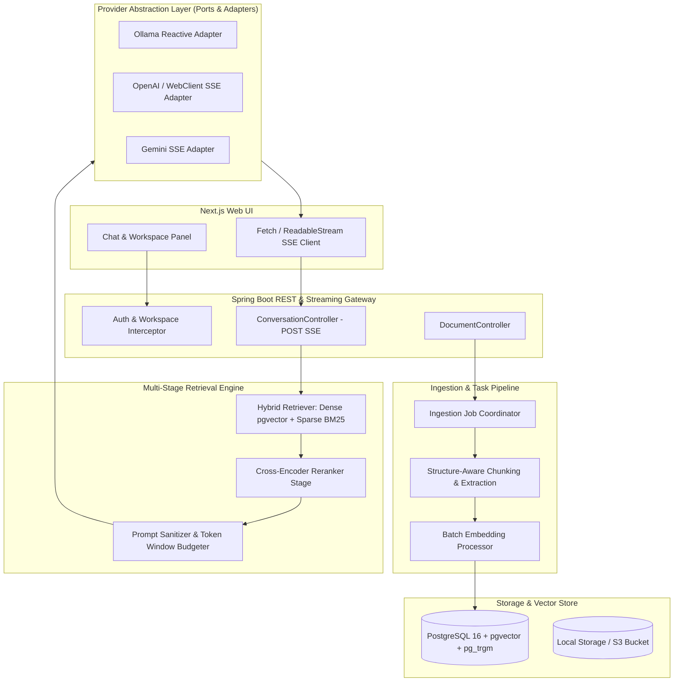

# Atlas Master Implementation & Architecture Plan

Atlas is a self-hosted AI knowledge workspace. It lets users organize private source material into isolated workspaces, ask grounded questions, and receive streamed answers with traceable citations. 

This master plan combines the core product roadmap with architectural counterplan improvements, prioritizing immediate technical debt remediation, production-grade RAG pipelines, and enterprise security.

## Priority & Phase Definitions

- **Phase 0 (P0 Remediation) — Must Fix Immediately:** Critical security, database, streaming, and data pipeline fixes to transform existing prototype stubs into a reliable, non-blocking vertical slice.
- **Phase 1 (P0/P1 Infrastructure) — Production RAG & Ingestion:** Batch embedding, structure-aware chunking, hybrid retrieval (Dense + BM25 + RRF), and true async job queues.
- **Phase 2 (P1/P2 Expansion) — Enterprise Security & Advanced Engine:** Authentication, RBAC, prompt injection boundaries, sliding-window token budgeting, and citation precision filtering.
- **Phase 3 (P2/P3 Advanced) — Scalability & Knowledge Graph:** GraphRAG, knowledge visualization, agent workflows, plugin architecture, and horizontal scaling.

---

## Target System Architecture

---

## Roadmap & Task Breakdown

### Phase 0 — Core Foundation & Technical Debt Remediation (P0)

- [x] Define monorepo layout, Spring Boot / Next.js project structure, Docker Compose setup, and local environment configs.
- [x] Establish PostgreSQL with `pgvector` extension and initial database schema migrations ([V1__initial_schema.sql](file:///Users/nicholopardines/Desktop/Github_Projects/atlas_knowledge_base/backend/src/main/resources/db/migration/V1__initial_schema.sql)).
- [x] Build basic workspace CRUD, document upload, and UI panels (Chat, Sources, Document list).
- [ ] **[CRITICAL FIX] Database Schema Safeguards**: Change `message_citations.chunk_id` foreign key from `ON DELETE RESTRICT` to `ON DELETE CASCADE` in [V1__initial_schema.sql](file:///Users/nicholopardines/Desktop/Github_Projects/atlas_knowledge_base/backend/src/main/resources/db/migration/V1__initial_schema.sql#L52) so deleting a document is not blocked by historical conversation citations.
- [ ] **[CRITICAL FIX] True SSE Reactive Streaming**: Remove thread-blocking `generate()` calls and simulated `Thread.sleep(15)` token splitting in [DefaultLlmProvider.java](file:///Users/nicholopardines/Desktop/Github_Projects/atlas_knowledge_base/backend/src/main/java/dev/atlas/providers/DefaultLlmProvider.java#L72-L90). Implement true reactive SSE streaming using Spring `WebClient` or HTTP/2 `HttpClient`.
- [ ] **[CRITICAL FIX] Robust Typed JSON Parsing**: Replace brittle `indexOf("\"embedding\":[")` and manual substring slicing across [DefaultEmbeddingProvider.java](file:///Users/nicholopardines/Desktop/Github_Projects/atlas_knowledge_base/backend/src/main/java/dev/atlas/providers/DefaultEmbeddingProvider.java#L131-L161) and [DefaultLlmProvider.java](file:///Users/nicholopardines/Desktop/Github_Projects/atlas_knowledge_base/backend/src/main/java/dev/atlas/providers/DefaultLlmProvider.java#L162-L285) with Jackson `ObjectMapper` DTOs.
- [ ] **[CRITICAL FIX] Secure POST-based SSE Endpoint**: Move the streaming chat endpoint from `GET /messages/stream?query=...` ([ConversationController.java](file:///Users/nicholopardines/Desktop/Github_Projects/atlas_knowledge_base/backend/src/main/java/dev/atlas/chat/ConversationController.java#L114-L152)) to `POST /messages/stream` with JSON body payload to prevent user queries from leaking into proxy and server access logs.
- [ ] **[CRITICAL FIX] Persistent Ingestion Task Queue**: Replace in-memory `@Async` void execution in [IngestionService.java](file:///Users/nicholopardines/Desktop/Github_Projects/atlas_knowledge_base/backend/src/main/java/dev/atlas/documents/IngestionService.java#L33-L76) with a persistent `ingestion_jobs` database queue and startup recovery handler to re-queue orphaned `PROCESSING` tasks after backend restarts.

### Phase 1 — Ingestion Engine & Production RAG Infrastructure (P1)

- [ ] **Batch Embedding Execution**: Upgrade `EmbeddingProvider` interface to support batch embeddings (`embedBatch(List<String> texts)`), replacing serial HTTP loops with single batch requests (OpenAI `input[]`, Gemini `batchEmbedContents`).
- [ ] **Structure-Aware & Token-Aware Chunking**: Replace naive character slicing with structure-aware chunking for Markdown (heading boundaries), PDF (paragraph/page boundaries), and HTML/Docx, constrained by tokenizer token budgets (`jtoken-counting` / `cl100k_base`).
- [ ] **HNSW Vector Indexing & Dynamic Dimensions**: Add HNSW index (`USING hnsw (embedding vector_cosine_ops)`) to `document_chunks` and add schema support for dynamic embedding dimensions (e.g., 768 for Gemini, 1024 for Ollama, 1536 for OpenAI).
- [ ] **Sparse Keyword Indexing & Hybrid Retrieval**: Add PostgreSQL `tsvector` column and GIN full-text index to `document_chunks`. Implement Reciprocal Rank Fusion (RRF) to merge vector similarity search with BM25 sparse keyword matching.
- [ ] **Reranking Stage**: Add cross-encoder reranking stage to re-score hybrid search candidates before prompt construction.
- [ ] **Citation Precision Filtering**: Post-process model outputs to map saved citations in `message_citations` strictly to source markers (e.g. `[1]`, `[2]`) explicitly cited in the final generated text, filtering out unreferenced retrieved chunks.

### Phase 2 — Enterprise Security, Quality & Operations (P2)

- [ ] **Authentication & Authorization**: Integrate Spring Security with JWT/Session management and enforce strict workspace-level RBAC (Owner/Editor/Viewer).
- [ ] **Prompt Injection Defense**: Wrap retrieved context chunks in explicit XML delimiters (`<context_chunk id="...">...</context_chunk>`) and sanitize prompt inputs to prevent indirect prompt injection attacks.
- [ ] **Sliding-Window Conversation History**: Enforce a token-budget limit on conversation turns injected into prompt templates, truncating oldest turns to prevent context window overflow.
- [ ] **Connection Pooling & Resilience**: Configure HikariCP connection pool settings (`maximum-pool-size`, `connection-timeout`, `idle-timeout`) and add Resilience4j circuit breakers/exponential backoff for cloud LLM APIs (429/5xx status codes).
- [ ] **Retrieval Evaluation & Observability**: Set up Ragas / TruLens benchmark scripts for retrieval quality, and add Prometheus/Micrometer metrics for Time-To-First-Token (TTFT) and retrieval latency.

### Phase 3 — Advanced Knowledge Engine & Integrations (P3)

- [ ] **GraphRAG Pipeline**: Extract entity-relationship graphs with provenance linking to source chunks.
- [ ] **Knowledge Graph Visualization**: Interactive graph exploration of workspace entities, documents, and concepts.
- [ ] **External Source Connectors**: Support GitHub repository incremental sync, Obsidian vault import, and Google Drive / Notion connectors.
- [ ] **MCP (Model Context Protocol) Integration**: Auditable tool-use and bounded agent execution within workspace isolation.
- [ ] **Plugin System & Multi-Node Scaling**: Plugin extension points and guidance for multi-node horizontally scaled deployments.

---

## Release Milestones

| Milestone | Target Exit Criteria |
| :--- | :--- |
| **M0: Foundation & Debt Remediation** | Cascade FK deletes working, true `WebClient` SSE streaming operational, Jackson DTO parsing enabled, and persistent ingestion job recovery active. |
| **M1: High-Performance Vertical Slice** | Batch embedding active, structure-aware chunking deployed, hybrid search (Dense + BM25 + RRF) functional, and POST SSE endpoint live. |
| **M2: Production Self-Hosted V1** | Docker Compose stack with persistent pgvector/pg_trgm storage, HNSW vector indexing, prompt injection safeguards, and citation precision filtering. |
| **M3: Collaborative Enterprise Workspace** | Spring Security auth/RBAC active, circuit breaker resilience configured, conversation token window budgeting complete, and evaluation suites verified. |

---

## Architecture Guardrails & Engineering Principles

1. **No Simulated Streaming**: Never use artificial delays (`Thread.sleep()`) or full synchronous string buffering to fake streaming. All streaming endpoints must pass reactive chunks directly from upstream SSE connections.
2. **No Raw String JSON Parsing**: Always parse external API payloads using Jackson `ObjectMapper` with strongly typed Java DTOs to avoid silent data corruption.
3. **No GET-Based SSE Prompt Endpoints**: Never pass user queries or prompts via URL query parameters in GET requests. Use `POST` body payloads to prevent logging sensitive user data in access logs.
4. **Strict Context XML Boundaries**: Always wrap retrieved chunks in distinct XML elements (`<context_chunk id="...">`) and escape prompt inputs to prevent indirect prompt injection.
5. **Batch Over Serial Execution**: Never issue serial HTTP calls per chunk for embedding generation. Enforce batch embedding requests (`embedBatch`) at the provider interface level.
6. **Cascade Deletion Integrity**: Data models and database constraints must allow document and workspace deletion without throwing foreign key violations on historical citation tables.
7. **Workspace Isolation Context**: Treat workspace ID as a mandatory parameter at every repository, retrieval, and cache level.
8. **Decoupled Architecture**: Keep provider adapters, parsers, chunking strategies, and vector storage strictly behind interface contracts.
