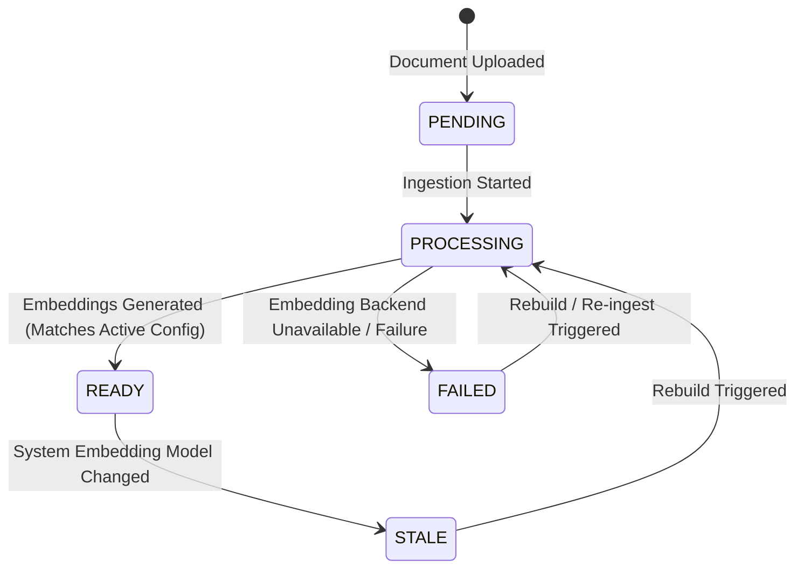

# Phase 1 Data Model: Vector Embeddings & Index Rebuilding

**Feature**: `003-improve-vector-embeddings`  
**Date**: 2026-08-02

## Entity Definitions

### 1. Embedding Identity (Value Object)

Represents the vector space contract under which document chunks were embedded.

| Field        | Type    | Description                   | Validation / Constraints                                     |
| ------------ | ------- | ----------------------------- | ------------------------------------------------------------ |
| `model`      | String  | Identifier of embedding model | Non-blank (e.g. `nomic-embed-text`, `mxbai-embed-large`)     |
| `dimensions` | Integer | Length of output vector       | Must match active database column vector size (768d default) |

---

### 2. Workspace (Aggregate Root - Extended)

Represents a knowledge workspace containing source documents and vector indexes.

| Column / Attribute     | Database Type            | Description                                              | Validation / Rules                    |
| ---------------------- | ------------------------ | -------------------------------------------------------- | ------------------------------------- |
| `id`                   | UUID                     | Unique workspace identifier                              | Primary Key                           |
| `name`                 | VARCHAR(255)             | User-visible workspace name                              | Non-blank                             |
| `embedding_model`      | VARCHAR(120)             | Active embedding model stamped at last complete indexing | Nullable until first ingest completes |
| `embedding_dimensions` | INTEGER                  | Vector dimensions stamped at last complete indexing      | Nullable until first ingest completes |
| `created_at`           | TIMESTAMP WITH TIME ZONE | Creation timestamp                                       | Auto-set                              |
| `updated_at`           | TIMESTAMP WITH TIME ZONE | Last modification timestamp                              | Auto-set                              |

---

### 3. Document (Entity - Extended)

Source document uploaded by user and indexed into chunks.

| Column / Attribute     | Database Type            | Description                                           | Validation / Rules                           |
| ---------------------- | ------------------------ | ----------------------------------------------------- | -------------------------------------------- |
| `id`                   | UUID                     | Unique document identifier                            | Primary Key                                  |
| `workspace_id`         | UUID                     | Foreign Key to Workspace                              | Required, CASCADE delete                     |
| `filename`             | VARCHAR(255)             | Stored file key in file storage                       | Required                                     |
| `original_filename`    | VARCHAR(255)             | Display filename                                      | Required                                     |
| `mime_type`            | VARCHAR(100)             | Content MIME type                                     | Supported types: PDF, MD, TXT                |
| `file_size_bytes`      | BIGINT                   | Size of file                                          | Must be > 0                                  |
| `ingestion_status`     | VARCHAR(50)              | Status: `PENDING`, `PROCESSING`, `COMPLETE`, `FAILED` | Required                                     |
| `embedding_model`      | VARCHAR(120)             | Model used for current chunks of this document        | Nullable; populated upon indexing completion |
| `embedding_dimensions` | INTEGER                  | Dimensions used for current chunks of this document   | Nullable; populated upon indexing completion |
| `error_message`        | TEXT                     | Ingestion or embedding error details                  | Nullable                                     |
| `created_at`           | TIMESTAMP WITH TIME ZONE | Upload timestamp                                      | Auto-set                                     |

#### Derived State: `health_status`

The API surfaces a calculated `health_status` property for each document relative to system configuration:

```text
if (ingestion_status == 'FAILED') -> FAILED
else if (ingestion_status in ['PENDING', 'PROCESSING']) -> PENDING
else if (ingestion_status == 'COMPLETE') {
  if (document.embedding_model == active_config.model && document.embedding_dimensions == active_config.dimensions)
    -> READY
  else
    -> STALE
}
```

---

### 4. Document Chunk (Entity)

Passage chunk extracted from source document with pgvector embedding.

| Column / Attribute | Database Type | Description                          | Validation / Rules                                 |
| ------------------ | ------------- | ------------------------------------ | -------------------------------------------------- |
| `id`               | UUID          | Unique chunk identifier              | Primary Key                                        |
| `document_id`      | UUID          | Foreign Key to Document              | Required, CASCADE delete                           |
| `ordinal`          | INTEGER       | Index of chunk within document       | 0-indexed                                          |
| `content`          | TEXT          | Passage text content                 | Non-empty                                          |
| `source_locator`   | JSONB         | Location metadata (page, line range) | JSON object                                        |
| `embedding`        | VECTOR(768)   | Float vector embeddings from Ollama  | Length must match active vector dimension contract |

---

### 5. Rebuild Status & Response (DTOs)

Structures for managing and inspecting workspace re-indexing.

```typescript
interface WorkspaceIndexHealthDTO {
  workspace_id: string;
  active_embedding_identity: {
    model: string;
    dimensions: number;
  };
  indexed_embedding_identity: {
    model: string | null;
    dimensions: number | null;
  } | null;
  status: "READY" | "STALE" | "PENDING" | "FAILED";
  total_documents: number;
  ready_documents: number;
  stale_documents: number;
  pending_documents: number;
  failed_documents: number;
}

interface RebuildWorkspaceResponseDTO {
  workspace_id: string;
  status: "COMPLETED" | "PARTIAL_FAILURE" | "FAILED";
  total_processed: number;
  rebuilt_count: number;
  failed_count: number;
  active_embedding_identity: {
    model: string;
    dimensions: number;
  };
  errors: Array<{
    document_id: string;
    filename: string;
    error_message: string;
  }>;
}
```

---

## State Transition Diagrams

### Document Indexing & Rebuild State Machine


